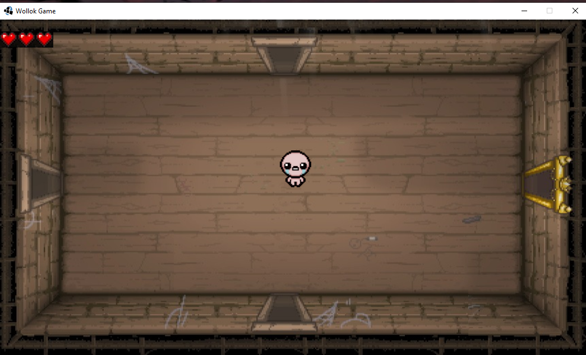
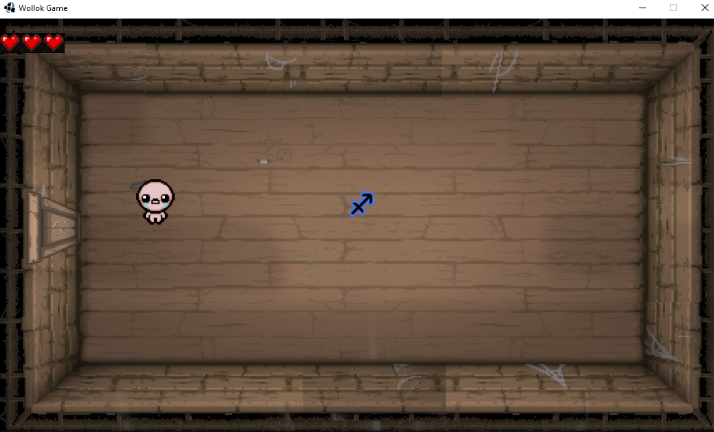
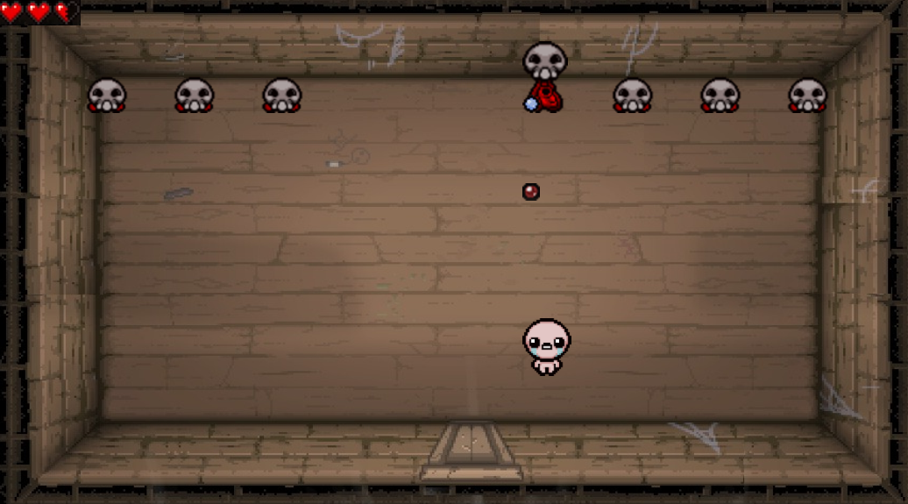

# Isaac

## Equipo de desarrollo

- Nicolas Pannunzio
- Federico Bietti
- Louders Mendez
- Alejo Dilluvio
- Ayelen Roa

## Capturas

## Reglas de Juego / Instrucciones

El juego esta basado en "The Binding of Isaac". El objetivo del juego es eliminar a todos los enemigos que
hay en el piso, pero cuidado que si te descuidas podrias ser tu el eliminado.

Para mover al personaje, utilizar:
- W para ir arriba
- A para ir a la izquierda
- S para ir abajo
- D para ir a la derecha

Para disparar, utilizar las flechas de direccion

## Otros

- K2002 / UTN Facultad regional de Buenos Aires
- Versión de wollok
- Una vez terminado, no tenemos problemas en que el repositorio sea público

